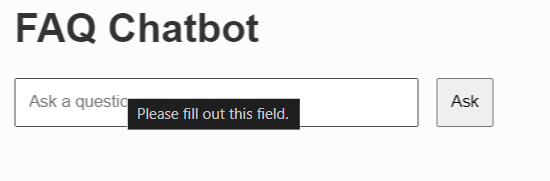
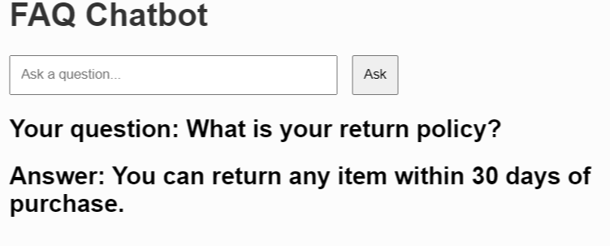

<hr>
## Disclaimer

This project was created as part of an assessment for Williams Lea. **Visitors are kindly requested not to call or reach out regarding this project.**
<hr>

# SimpleFAQ-Chat-App

## Overview
<br>
This project is a Simple FAQ Chatbot that leverages RDF, NLTK, Ontology, and SPARQL to provide automated answers to frequently asked questions. The chatbot is powered by Natural Language Processing (NLP) techniques and ontology-based knowledge representation. The system uses SPARQL to query the knowledge base represented in RDF.
<br>The chatbot is built to interpret user queries and return relevant answers based on the FAQ script, which is written in Turtle (TTL) format.

## Features<br>

- Query answering using NLP techniques with **punk_tab**.
- Knowledge base built using **RDF** and **ontology**.
- **SPARQL** query engine for retrieving answers from the knowledge base.
- A simple, intuitive interface for user interaction.

## Technologies Used:<br>

- **RDF (Resource Description Framework)**: For structuring and representing the knowledge base.
- **NLTK (Natural Language Toolkit)**: For handling text processing and NLP functionalities.
- **Ontology**: Used for defining relationships and structured information.
- **SPARQL**: A query language for RDF used to retrieve answers.
- **Turtle (TTL)**: The format used for writing the FAQ script.
- **punk_tab**: A key NLP component.

## Installation

1. Clone this repository:
   ```bash
   git clone https://github.com/Uma-dev99/SimpleFAQ-Chat-App.git
   ```
2. Install Dependencies: <br>
   ```
      pip install -r requirements.txt

   ```
3. Run the Chatbot: <br>
   ```
      python app.py
   
   ```

## Screenshots

Here are a couple of screenshots to demonstrate the chatbot in action:   



   
